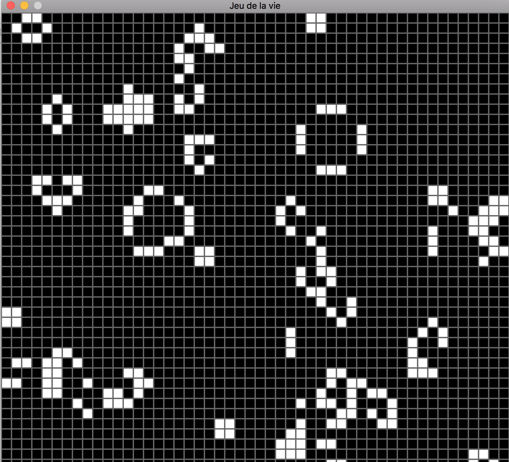

# jeudelavie (Ne marche pour l'instant que sur macos)

## Installation
  - Install SDL2 
    * http://lazyfoo.net/tutorials/SDL/01_hello_SDL/mac/index.php
  - Install SDL_TTF
    * https://www.libsdl.org/projects/SDL_ttf/
  - Put Pilgiche.ttf into /Library/Fonts folder
  - Create XCode Project with existing files
  - Link SDL2 et SDL2_TTF Library 
    
  - Compile and Enjoy
    
